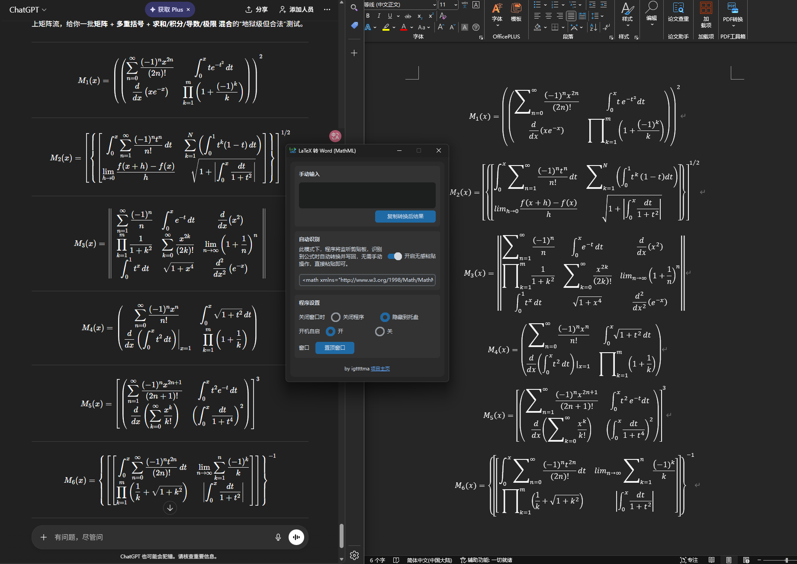

# latex2word

一个在 Windows 上使用的 LaTeX → MathML 小工具：把 LaTeX 公式转换成 Word 更容易识别的 MathML，并支持“无感粘贴”（监听剪贴板，自动把 LaTeX 替换成 MathML）。



## 功能

- 手动输入：粘贴/输入 LaTeX，点击按钮把转换结果复制到剪贴板
- 无感粘贴：自动识别剪贴板内容是否像 LaTeX，识别到后自动转换并写回剪贴板
- 托盘支持：可隐藏到托盘，通过托盘菜单快速操作
- 转换输出：输出 MathML（`<math xmlns="http://www.w3.org/1998/Math/MathML">...`）

## 二进制启动（推荐）

下载地址（v1.0）：<https://github.com/igttttma/latex2word/releases/tag/v1.0>

1. 在本项目 GitHub 的 Releases 页面，下载 `latex2word.exe`。
2. 开启“无感粘贴”后，在任意地方复制 LaTeX，回到 Word 粘贴即可。word将自动识别并生成含内容的公式框。

说明：

- 二进制版不需要安装 Python
- “开机自启”功能仅在 exe 版可用（源码运行会自动禁用该选项）
- 如果 Windows 弹出 SmartScreen 提示，可选择“更多信息”→“仍要运行”

## 推荐搭配：CopyTeX 浏览器插件（更稳定地复制 LaTeX）

网页版AI（例如ChatGPT，Gemini等）展示的是渲染后的数学公式，直接复制可能会丢失 LaTeX 或变成乱码。CopyTeX 是一款浏览器插件，可以让你从网页公式中“直接复制 LaTeX”，再配合本程序的无感粘贴模式，能获得更稳定的一键粘贴体验。

安装链接：

- Microsoft Edge：<https://microsoftedge.microsoft.com/addons/detail/copytex-%E2%80%93-instantly-copy-/ibnmhabmikbofkccpglnippndpdepgmd>
- Google Chrome：<https://chromewebstore.google.com/detail/copytex-%E2%80%93-instantly-copy/dnkgkjeghbgobiflkonjgnfdejoeeocg>
- Mozilla Firefox：<https://addons.mozilla.org/en-US/firefox/addon/copytex/>

使用建议：

1. 在浏览器中开启 CopyTeX 插件，鼠标双击公式即可复制 LaTeX。
2. 确保本程序的自动识别功能已开启（默认开启）。
3. 到 Word 里 ctrl+v 粘贴即可。

## 源码启动（开发者）

### 环境要求

- Windows（使用了 Win32 API：剪贴板监听、托盘、注册表设置）
- Python 3.10+（建议）
- 依赖：`latex2mathml`,`customtkinter`

> 说明：界面使用 `tkinter`（Python 自带）。如果你的 Python 发行版不包含 tkinter，需要改用带 tkinter 的 Python。

### 安装

```bash
python -m venv .venv
.venv\Scripts\activate
pip install latex2mathml customtkinter
```

### 运行

在项目根目录执行：

```bash
python .\src\app.py
```

### 打包（PyInstaller 单文件）

在项目根目录执行：

```bash
pyinstaller -F -w -n latex2word --clean --icon image/icon.ico --add-data "image/icon.ico;image" --collect-data latex2mathml src/app.py
```

输出：`dist/latex2word.exe`

## LaTeX 识别规则（无感粘贴）

无感粘贴模式下，程序会把剪贴板文本做一些快速判断，尽量避免误判：

- 过长文本（> 50000 字符）不处理
- 已经是 MathML 的不处理（包含 `<math` 或 MathML 命名空间）
- 包含 URL 或 Windows 路径（如 `C:\...`）的不处理
- 满足以下任意条件则认为“像 LaTeX”并尝试转换：
  - 包含 `$`
  - 出现 `\command` 风格命令（如 `\frac`）
  - 出现上下标（如 `x^2`、`a_{ij}`）
  - 出现 `{}`、`\\`、`&` 等常见 LaTeX 结构字符

## 转换说明

- 默认使用 `latex2mathml` 做 LaTeX → MathML 转换
- 转换后会做一层 MathML 规范化/兼容性处理（例如修复不合法的 `&`、补充 `display="block"` 等）
- 当 `latex2mathml` 不可用或转换失败时，代码里包含一个针对特定输入格式的兜底解析逻辑（见 `src/converters/latex_to_mathml.py` 中的 `convert`）

## 项目结构

- `src/app.py`：启动入口
- `src/ui/`：Tkinter 界面、托盘、剪贴板监听、设置
- `src/converters/`：LaTeX → MathML 转换
- `src/services/clipboard.py`：Win32 剪贴板读写
- `src/utils/latex_cleaner.py`：输入清洗（去掉 `$$`、`equation` 环境等）

## 常见问题

### 无感粘贴会不会影响我复制普通文本？

代码中已经尽量避免，但仍可能误判（例如某些文本包含 `_`、`^`、`\`）。如有影响，可在右下角托盘菜单中暂时关闭“无感粘贴”。

## License

本项目采用 GNU General Public License v3.0（GPL-3.0）。
